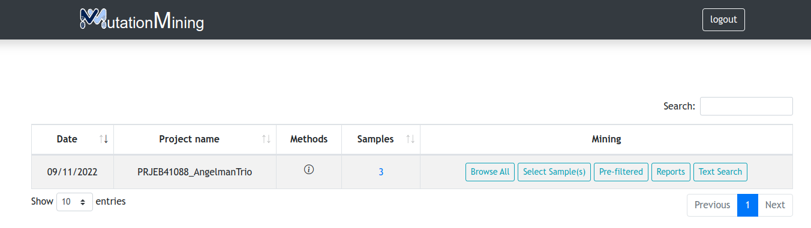

# Home Page

After entering the email address correctly, you will find yourself on the following [page](https://mutationmining.usal.es/home)

For this guide we have used the project PRJEB41088\_AngelmanTrio (link), each user will have an associated project that may be different from others, but the structure is the same for all of them

| Column Name       | Description                                           |
| ----------------- | ----------------------------------------------------- |
| Date              | Date of project creation                              |
| Project Name      | Name assigned to the project                          |
| Methods           | Project description and versions used in its creation |
| Number of samples | Number of samples contained in the project            |
| Mining            | Useful buttons to display different results           |

#### In this section there are four possibilities

* [Display variants for all samples](page-1.md)

* Open [report](display-variants-for-samples/mutations.md), [prediction of populations](display-variants-for-samples/populations.md) and variants [table by samples](display-variants-for-samples/)

* [Display projects with user-saved filters](filtered-variants.md)

* Genomic tables [text search section](text-search.md)

