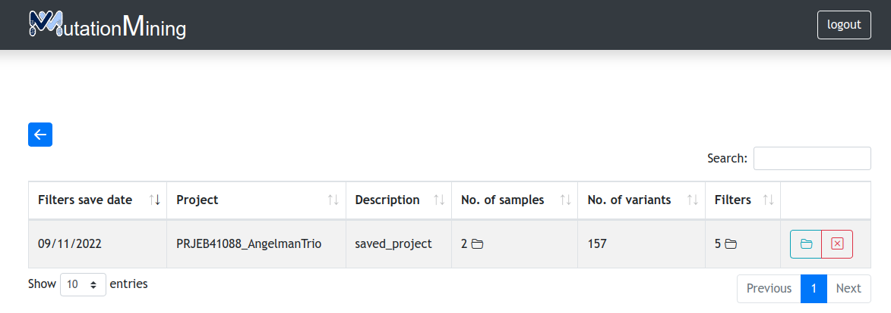
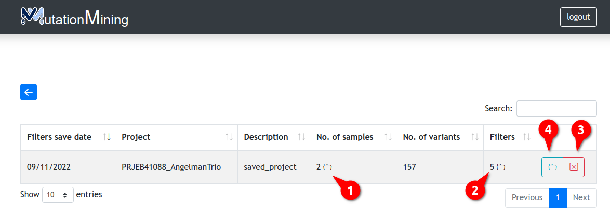

# Filtered Variants

In this page we will be able to observe the filtered projects saved by the user.

| Column Name       | Description                                             |
| ----------------- | ------------------------------------------------------- |
| Filters save date | Date filters were saved                                 |
| Project           | Name of the project to which it refers                  |
| Description       | Name of filtered project                                |
| No. of samples    | Number of samples saved                                 |
| No. of variants   | Number of variants saved                                |
| Filter            | Filters added in the project                            |
| Action buttons    | 
Open filtered project Delete filtered project
 |

1. View the name of the samples
2. View the filters added to the project
3. Delete filtered project
4. Open filtered project
