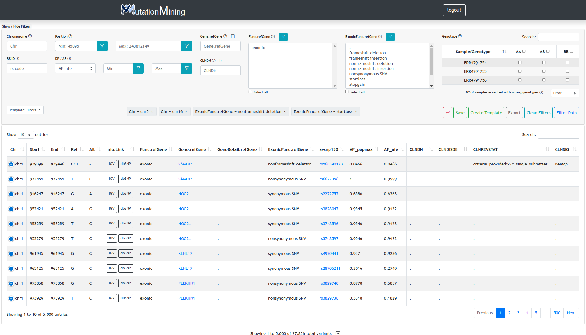

# Display variants for all samples

By clicking on the `Browse All` button, the initial page will show the following information (this is an example and the number of variants may be different in other projects)

When you click the `OK` button or press `ENTER` on your keyboard, you will see the structure of the page to start applying filters to your project

### Section 1 (Filters Layout)

| Field Name             | Description                                                                                                                                                                                                                                                                                                                                                                                                          | How to add filter                                                                                                                |
| ---------------------- | -------------------------------------------------------------------------------------------------------------------------------------------------------------------------------------------------------------------------------------------------------------------------------------------------------------------------------------------------------------------------------------------------------------------- | -------------------------------------------------------------------------------------------------------------------------------- |
| Chromosome             | Chromosome location of the variants                                                                                                                                                                                                                                                                                                                                                                                  | 
Type and press Enter on the keyboard Display the options and select one
                                                |
| Position               | Base position of the variants, please insert a genomic interval                                                                                                                                                                                                                                                                                                                                                      | Type and press Enter on the keyboard or click on the filter button                                                               |
| DP / AF                | 
DP: Mean of sequencing depth of variants

AF: Allele frequency on population sequencing projects
                                                                                                                                                                                                                                                                                                         | Display the available filters in the list, then type and press Enter on the keyboard or click on the filter button.              |
| Gene.refGene           | Insert (+) or select Gene regions identified with their symbol where variants could be located                                                                                                                                                                                                                                                                                                                       | 
Type and press Enter on the keyboard Display the options and select one
                                                |
| CLNDN                  | Insert (+) or select [ClinVar](https://www.ncbi.nlm.nih.gov/clinvar/) terms associated with target variations.                                                                                                                                                                                                                                                                                                       | 
Type and press Enter on the keyboard Display the options and select one
                                                |
| Func.refGene           | 
Position of the variant relative to the nearest gene
<ul><li>Exonic: in the coding region of the gene</li><li>Splicing: in the 2-bp of the “splicing junction”</li><li>NcRNA: over a non-coding transcript</li><li>UTR5, UTR3: in a 5' or 3' non-translated region</li><li>upstream/donwstream: less than 1kb from the start or end of the transcription</li><li>Intergenic: in an intergenic region</li></ul> | Select one item, several items by pressing control on the keyboard or all by clicking `select all` and press enter               |
| ExonicFunc.refGene     | 
Variant effect on exonic regions
<ul><li>Synonymous: the variant does not change the resulting protein</li><li>Missense: the variant change one amino acid on the resulting protein</li><li>Nonsense: the variant generates a stop codon</li><li>FrameshiftDeletion/Insertion: the variant cause a change on the reading frame</li></ul>                                                                       | Select one item, several items by pressing control on the keyboard or all by clicking `select all` and press enter               |
| Samples \[+] Genotype  | Associate samples to genotypes. Please, move the samples to the corresponding genotype and press the filter button                                                                                                                                                                                                                                                                                                   | Select one sample or several samples by pressing control on the keyboard, after click on genotype button and press filter button |

### Section 2 (Template Filters)

When we have one or more filters selected and we want to save this information, we click on the `Create template` button in section 3.

Once saved, the name of the template will be added to the drop-down list.

Clicking on one of the options in this list will add the saved filters to the current project.

### Section 3 (List of applied filters)

In this section the selected filters will be displayed

### Section 4 (Filter buttons)

|                    Name button                   | Action                                                                                                          |
| :----------------------------------------------: | --------------------------------------------------------------------------------------------------------------- |
|     | Back to previous page                                                                                           |
|           | Save project in the filtered variants section of the home page                                                  |
|       | Save the currently selected filters to the project and add this option to the "Template filters" drop-down list |
|         | Export current filtered variants in excel format                                                                |
|  | Delete all selected filters and restart the project                                                             |
|    | Filter the variants with the filters selected in section 3                                                      |

### Section 5 (Variants table)

Table of variants
