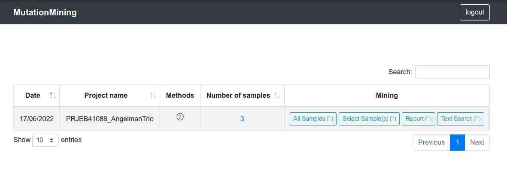
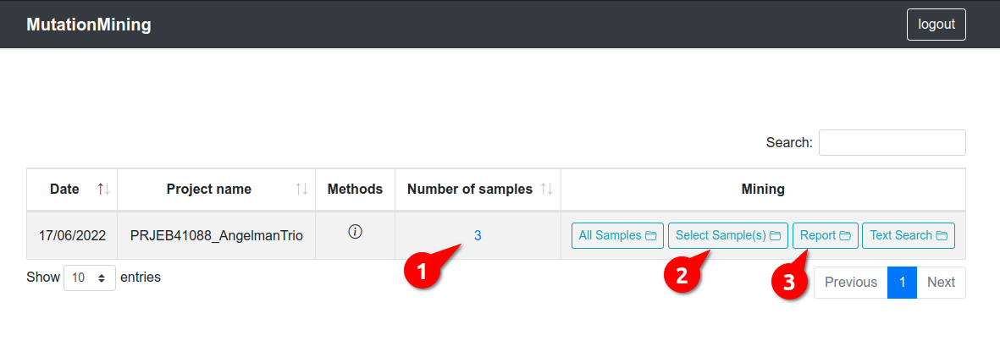
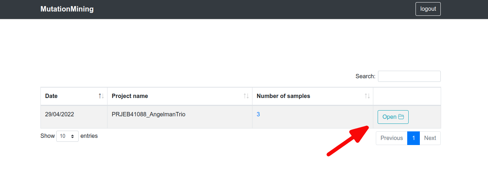

# Sequencing Projects

For this guide we have used the project PRJEB41088\_AngelmanTrio (link), each user will have an associated project that may be different from others, but the structure is the same for all of them

| Column Name       | Description                                |
| ----------------- | ------------------------------------------ |
| Date              | Date of project creation                   |
| Project Name      | Name assigned to the project               |
| Number of samples | Number of samples contained in the project |
| Open button       | Display project variants                   |

In this section there are two possibilities

* [Open report](sequencing-projects/display-variants-for-samples/), prediction of populations and variants table by samples

* [Display variants for all samples](page-1.md)

