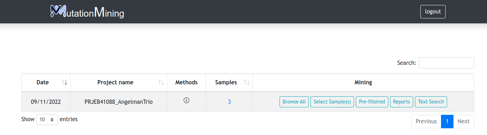
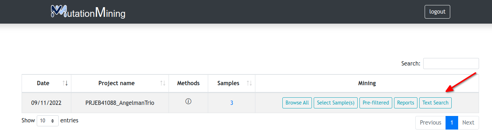

# Sequencing Projects

For this guide we have used the project PRJEB41088\_AngelmanTrio (link), each user will have an associated project that may be different from others, but the structure is the same for all of them

| Column Name       | Description                                           |
| ----------------- | ----------------------------------------------------- |
| Date              | Date of project creation                              |
| Project Name      | Name assigned to the project                          |
| Methods           | Project description and versions used in its creation |
| Number of samples | Number of samples contained in the project            |
| Mining            | Useful buttons to display different results           |

### In this section there are three possibilities

* [Display variants for all samples](page-1.md)

* Open report, prediction of populations and variants [table by samples](sequencing-projects/display-variants-for-samples/)

* Genomic tables [text search section](sequencing-projects/text-search.md)

