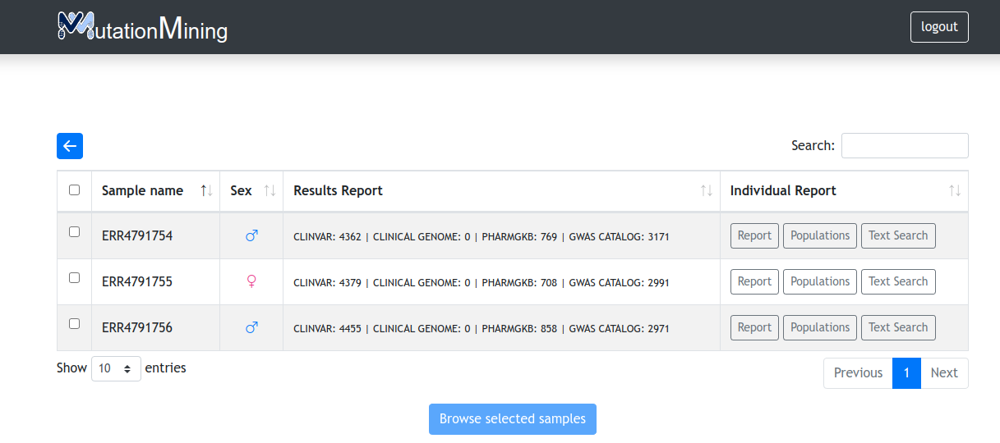
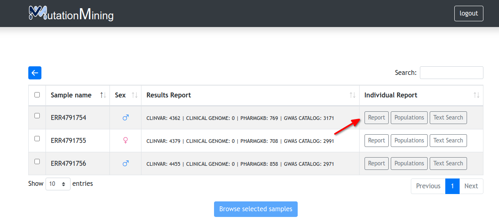

# Display variants for samples

In this page we can perform different options&#x20;

* **Select one or more samples** **and display the variants table**. How to do this? Click on the check box next to the sample name and then click on the Browse selected samples button. Then a window similar to the one explained in the [display variants for all samples](../../page-1.md) section will appear, but only the selected samples will be displayed

* [View the genomic database variants related to the sample](mutations.md)

* [View prediction of possible sample origins](populations.md)

