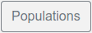
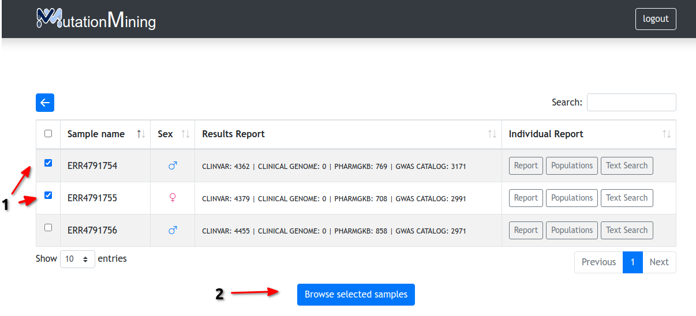
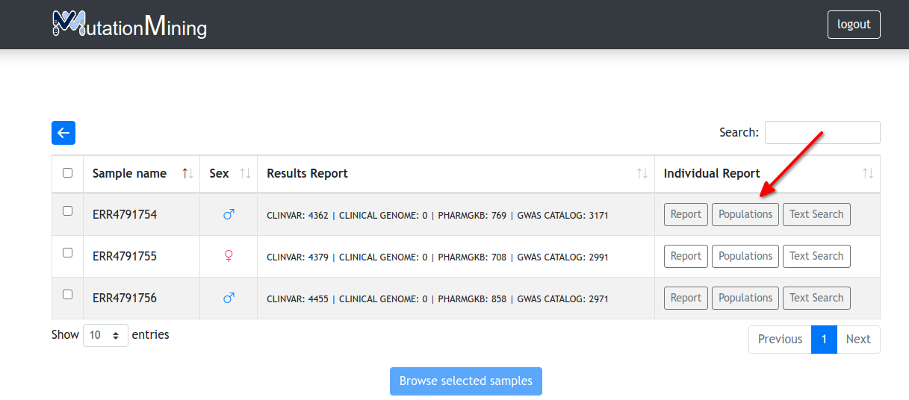

# Display variants for samples

When we click on the number of samples, a table similar to the following is displayed

| Name column       | Description                                                                                                                               |
| ----------------- | ----------------------------------------------------------------------------------------------------------------------------------------- |
| Sample name       | Name of sample                                                                                                                            |
| Results Report    | Number of total variants in each genomic database                                                                                         |
| Individual Report |   |

In this page we can perform different options

### View variants table for sample(s)

* **Select one or more samples** **and display the variants table**. How to do this? Click on the check box next to the sample name and then click on the Browse selected samples button. Then a window similar to the one explained in the [display variants for all samples](../../page-1.md) section will appear, but only the selected samples will be displayed

### Mutations

* [View the genomic database variants related to the sample](mutations.md)

### Populations

* [View prediction of possible sample origins](populations.md)

