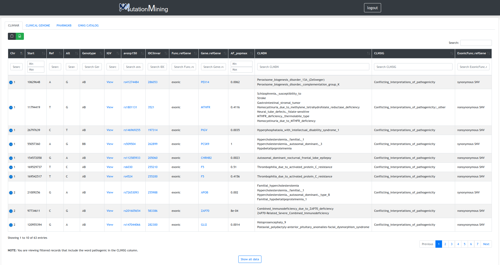
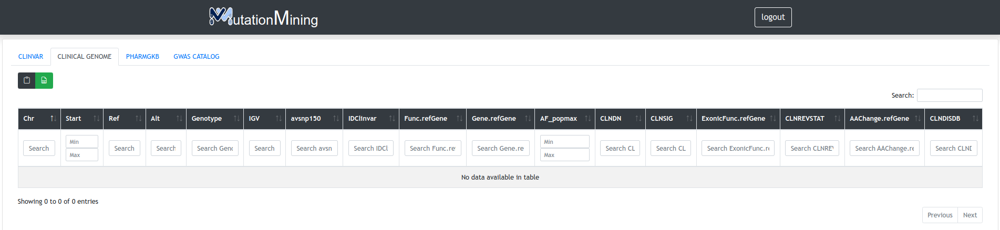
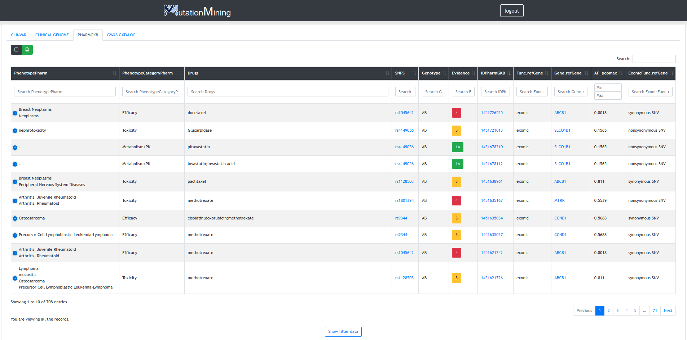
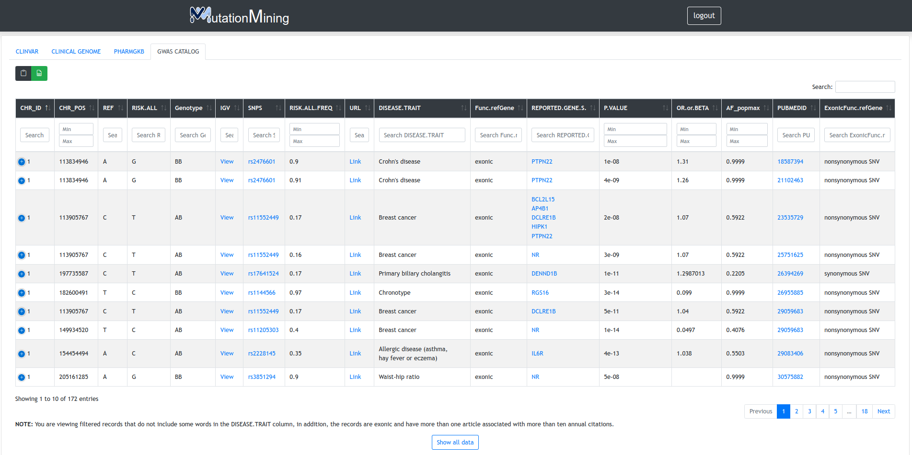

# Mutations

This page shows the project variants related to the following genomic databases

### Clinvar

Initially, only variants that include the word pathogen in the CLINSG column are shown, to show all variants click on the "show all data" button.

| Column name                                   | Description                                                       |
| --------------------------------------------- | ----------------------------------------------------------------- |
| Chr                                           | Hola                                                              |
| Otro                                          | tal                                                               |
| asdasdasdasdasdasdasdasdasdasdasdasdasdasdasd | asdasdasdasdasdasdasdasdasdasdasdasdasdasd a dasd asd asd adasd a |

### Clinical Genome

### PharmGKB

Initially, only variants with evidence level 1 or 2 are shown, to show all variants click on the show all data button.

### GWAS Catalog

Initially, only variants that not include some words in the DISEASE.TRAIT column, are exonic and have more than one article associated with more than ten annual citations, to show all variants click on the show all data button.
