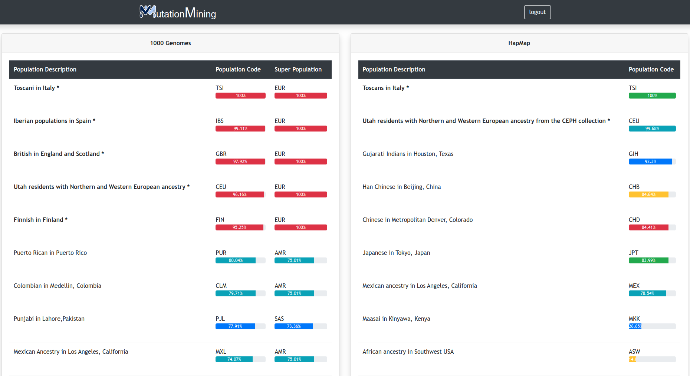

# Populations

In this page we can observe the probability that a sample has of belonging to a certain population, these data have been obtained by crossing the variants of a given project with the 1000 Genomes and HapMap databases. In addition, the populations that are in bold and with an asterisk denotes a high reliability index.

