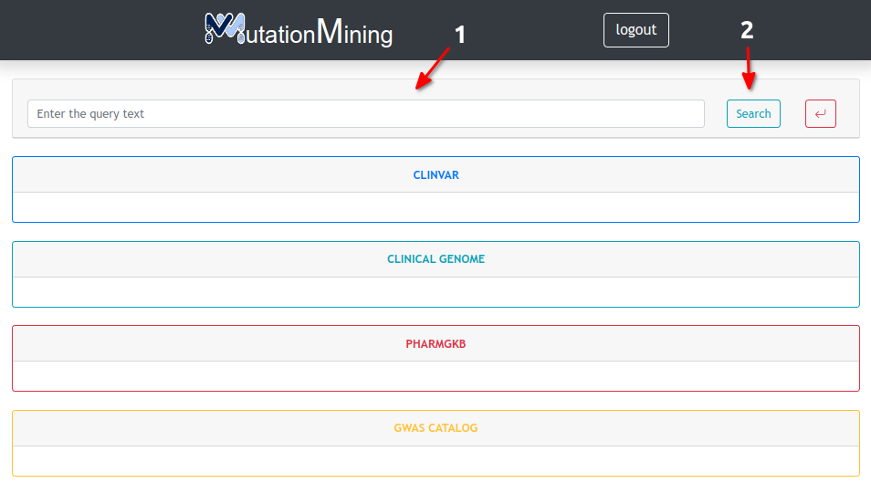
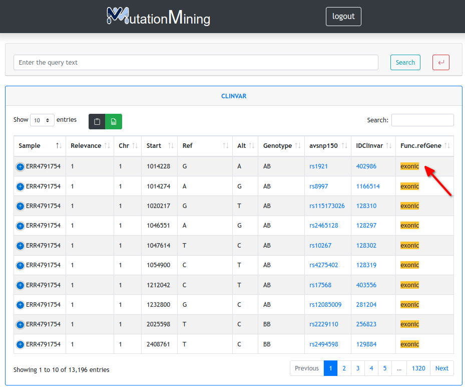

# Text Search

This page shows the result of the text search in the genomic databases. If you want to see the information of these tables go to [Mutations](display-variants-for-samples/mutations.md)

Here is a simple example on how to use this tool

1. Enter the text in section 1 and press the search button
2. Show results with the searched text highlighted

